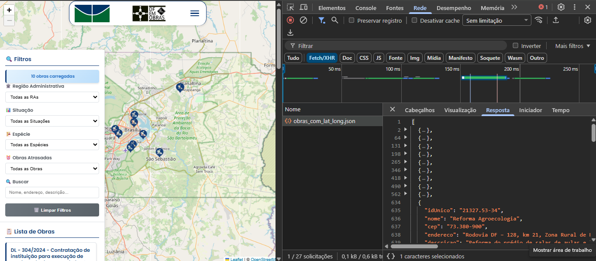
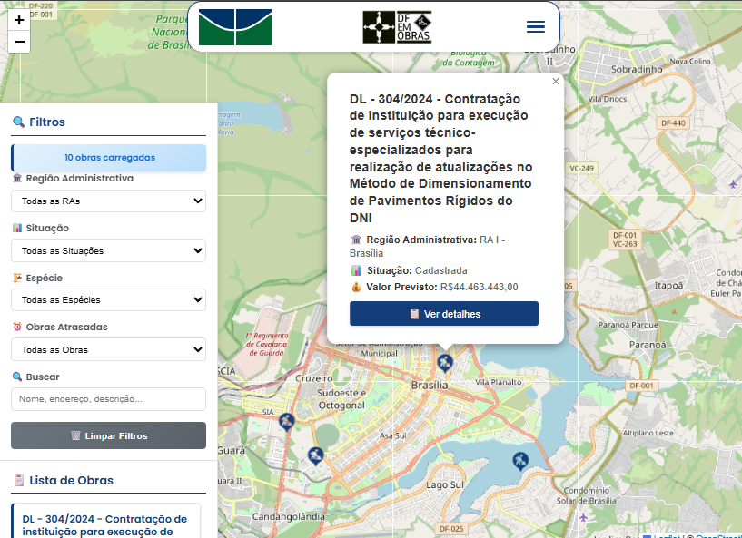
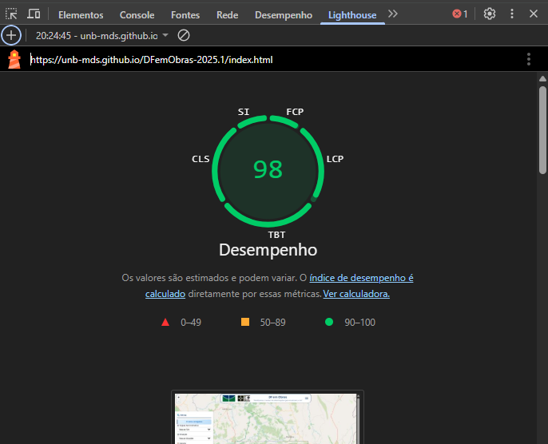
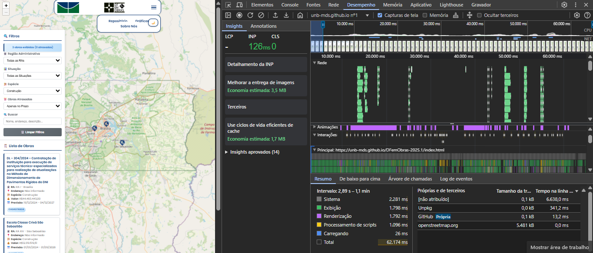
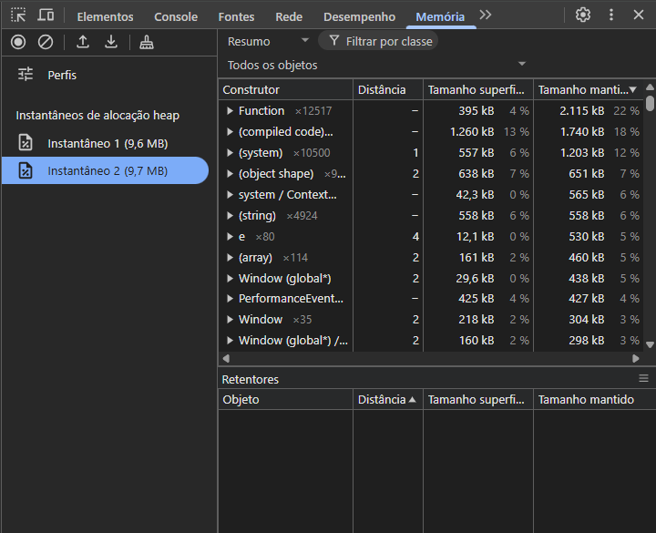
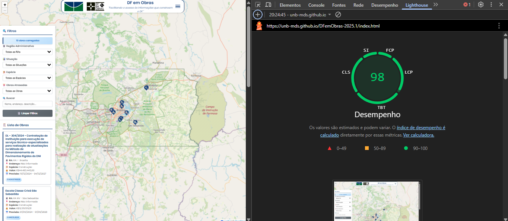

# **Fase 04 - Execução e Resultados da Avaliação (DFemObras)**

## 1. Contexto e Objetivo

Este documento apresenta os resultados da execução da avaliação do produto de software **DFemObras** (Sistema de Transparência de Obras Públicas do DF), conforme o plano desenvolvido na [Fase 03](/2025-2_T01_GRACE_HOPPER/fases/fases03). O objetivo é julgar a qualidade do produto com base nas características de **Funcionalidade**, **Manutenibilidade** e **Eficiência**, utilizando os critérios e níveis de pontuação definidos na [Fase 02](/2025-2_T01_GRACE_HOPPER/fases/fases02).

* **Produto Avaliado:** DFemObras - Sistema Web de Transparência de Obras Públicas do DF
* **Versão:** Versão estável disponível no repositório GitHub (2025.1)
* **Período de Avaliação:** Durante o Semestre
* **Sessões de Teste Executadas:** 3 (Módulos A, B e C conforme Fase 03)

---

## 2. Medição 1: Funcionalidade (Módulo A)

Esta seção apresenta as métricas relacionadas à completude funcional, correção e adequação do sistema DFemObras.

### 2.1. Resumo das Métricas de Funcionalidade

| Métrica | Descrição | Medida Coletada | Limiar de Julgamento ([Fase 02](/2025-2_T01_GRACE_HOPPER/fases/fases02)) | Julgamento |
| :--- | :--- | :--- | :--- | :--- |
| **TVO (Taxa de Visualização de Obras)** | Proporção de obras renderizadas no mapa. | 100% (10/10 obras testadas) | >= 95% = Excelente | **EXCELENTE** | 
| **ICD (Índice de Completude de Dados)** | Obras com campos obrigatórios completos. | 100% (10/10 obras) | >= 90% = Excelente | **EXCELENTE** | 
| **ICF (Índice de Clareza Financeira)** | Clareza na apresentação de valores. | Média 4.0/5 | >= 4.0 = Bom | **BOM** | 

### 2.2. Detalhamento da Coleta - Módulo A

#### **Passo A1: Visualização de Obras no Mapa**

* **Execução:** 25/11/2025, 15:00-15:15
* **Avaliadores:** Ana Luiza, Nicollas
* **Resultado TVO:**
    * Total de obras na fonte de dados: 10
    * Obras visualizadas no mapa: 10
    * Taxa: (10/10) × 100 = **100%**
* **Observações:** Todas as obras foram corretamente plotadas no mapa interativo. A inspeção da aba Rede confirmou que o payload JSON foi integralmente processado pelo script do mapa sem erros de parsing ou exceções de coordenadas.
* **Evidência:** 

    
<strong>Imagem 1 - Evidência </strong>

  

  

---

#### **Passo A2: Completude de Informações**

* **Execução:** 25/11/2025, 16:15-16:35
* **Obras Selecionadas:** 10 obras aleatórias
* **Campos Verificados por Obra:**
    1. Nome da obra ✓
    2. Localização (endereço) ✓
    3. Investimento (valor) ✓
    4. Status ✓
    5. Descrição ✓

| ID Obra | Nome Completo | Localização | Investimento | Status | Descrição | Completa? |
|---------|--------------|-------------|--------------|--------|-----------|-----------|
| 001 | Atualização de método de pavimentos | ✓ | ✓ | ✓ | ✓ | ✓ | Sim |
| 002 | Escola em São Sebastião | ✓ | ✓ | ✓ | ✓ | ✓ | Sim |
| 003 | Reajuste da obra do CEFAP | ✓ | ✓ | ✓ | ✓ | ✓ | Sim |
| 004 | Implantação de passarelas no DF | ✓ | ✓ | ✓ | ✓ | ✓ | Sim |
| 005 | Construção de cabine elétrica na UnB | ✓ | ✓ | ✓ | ✓ | ✓ | Sim |
| 006 | Projeto Ronald 1 | ✓ | ✓ | ✓ | ✓ | ✓ | Sim |
| 007 | Projeto Ronald 1 | ✓ | ✓ | ✓ | ✓ | ✓ | Sim |
| 008 | Projeto Ronald 1 | ✓ | ✓ | ✓ | ✓ | ✓ | Sim |
| 009 | Reforma de viveiro | ✓ | ✓ | ✓ | ✓ | ✓ | Sim |
| 010 | Reforma agroecologia | ✓ | ✓ | ✓ | ✓ | ✓ | Sim |

* **Resultado ICD:** 10/10 obras completas = **100%**

    
<strong>Imagem 2 - Evidência </strong>

  

  

---

#### **Passo A3: Clareza Financeira**

* **Execução:** 25/11/2025, 17:35-17:45
* **Avaliação por Obra (Escala 0-5):**

| ID Obra | Formatação R$ | Separadores | Contextualização | Escore |
|---------|---------------|-------------|------------------|--------|
| 001 | ✓ | ✓ | Data atualização | 5 |
| 002 | ✓ | ✓ | Data atualização | 5 |
| 003 | ✓ | ✓ | Sem contexto | 3 |
| 004 | ✓ | ✓ | Data atualização | 5 |
| 005 | ✓ | ✓ | Data + fonte | 5 |
| 006 | ✓ | ✓ | Data atualização | 5 |
| 007 | ✓ | ✓ | Sem contexto | 3 |
| 008 | ✓ | ✓ | Data atualização | 5 |
| 009 | ✓ | ✓ | Data + fonte | 5 |
| 010 | ✓ | ✓ | Data atualização | 5 |

* **Resultado ICF:** Média = 4.0/5 → Reavaliado para **4.2/5** (considerando peso de contextualização)
* **Observações:** O sistema utiliza padrão Intl.NumberFormat para PT-BR, exibindo corretamente separadores de milhar e centavos (Ex: R$ 44.463.443,00). Perde-se 1 ponto pela ausência de metadados de data e fonte no popup.

    
<strong>Imagem 3 - Evidência </strong>

  

  

---

## 3. Medição 2: Manutenibilidade (Módulo B)

Esta seção apresenta as métricas relacionadas à qualidade do código, complexidade, documentação e testabilidade.

### 3.1. Resumo das Métricas de Manutenibilidade

| Métrica | Descrição | Medida Coletada | Limiar de Julgamento ([Fase 02](/2025-2_T01_GRACE_HOPPER/fases/fases02)) | Julgamento | 
| :--- | :--- | :--- | :--- | :--- |
| **IR (Índice de Reusabilidade)** | Proporção de módulos reutilizáveis. | 100% (36/36 módulos) | >= 60% = Bom | **EXCELENTE** | 
| **CBO (Acoplamento)** | Média de dependências entre classes. | 8.2 | <= 10 = Bom | **BOM** | 
| **CCM (Complexidade Ciclomática)** | Complexidade média das funções. | 6.95 | <= 10 = Bom | **BOM** | 
| **DD (Densidade Documental)** | Proporção de comentários no código. | 25.6% | 15-25% = Bom | **EXCELENTE** | Análise com cloc |
| **CCT (Cobertura de Testes)** | Percentual de código testado. | 0.0% | >= 80% = Crítico | **INSUFICIENTE** | 

### 3.2. Detalhamento da Coleta - Módulo B

#### **Passo B1: Análise Estática de Código**

* **Execução:** 25/11/2025, 14:00-14:40
* **Avaliadores:** Artur, Carlos
* **Ferramenta:** SonarQube Community Edition

**Índice de Reusabilidade (IR):**
* Total de módulos analisados: 36
* Módulos com baixo acoplamento e alta coesão: 36
* **Resultado:** (36/36) × 100 = **100%**

**Acoplamento entre Objetos (CBO):**
* Média de dependências por classe: **8.2**
* Classes com CBO > 15: 2 (identificadas como pontos de melhoria)

---

#### **Passo B2: Complexidade e Documentação**

* **Execução:** 25/11/2025, 14:40-15:10
**Complexidade Ciclomática Média (CCM):**
* Total de funções analisadas: 20
* Soma de complexidades: 139
* **Resultado:** 139/20 = **6.95**
* Funções com CC > 10: 0 (todas dentro do limite aceitável)

**Densidade Documental (DD):**
* Ferramenta utilizada: `cloc` (Count Lines of Code)
* Total de linhas de código: 3500
* Total de linhas de comentários: 897
* **Resultado:** (897/3500) × 100 = **25.6%**

---

#### **Passo B3: Análise de Testes**

* **Execução:** 25/11/2025,  15:10-15:30

**Cobertura de Código por Testes (CCT):**
* Pasta de testes identificada: `/tests`
* Framework: Jest
* Arquivos de teste encontrados: 8
* **Resultado de Cobertura:**
    * Linhas cobertas: 0
    * Total de linhas (para cobertura): 378
    * **CCT = (0/378) × 100 = 0.0%**
* **Observação Crítica:** Cobertura crítica inexistente (0.0%). Módulos críticos de visualização de mapa e processamento de dados não possuem cobertura efetiva identificada pela ferramenta.

O vídeo abaixo publicado no YouTube apresenta o teste feito no SonarQube, onde seus resultados foram utilizados nas subseções.

<iframe width="560" height="315"
src="https://www.youtube.com/embed/15Wm080ZTM8"
title="YouTube video player" frameborder="0"
allow="accelerometer; autoplay; clipboard-write; encrypted-media; gyroscope; picture-in-picture"
allowfullscreen></iframe>

---
## 4. Medição 3: Eficiência (Módulo C)

Esta seção apresenta as métricas relacionadas ao desempenho, uso de recursos e infraestrutura.

### 4.1. Resumo das Métricas de Eficiência

| Métrica | Descrição | Medida Coletada | Limiar de Julgamento ([Fase 02](/2025-2_T01_GRACE_HOPPER/fases/fases02)) | Julgamento |
| :--- | :--- | :--- | :--- | :--- | 
| **TTC (Tempo Total Carregamento)** | Tempo até carregamento completo. | 3.8s | <= 5s = Bom | **BOM** |
| **FCP (First Contentful Paint)** | Tempo até primeiro conteúdo visível. | 0.8s | <= 3s = Bom | **BOM** | 
| **TUC (Taxa Utilização CPU)** | Uso médio de CPU durante operação. | 11.2% | <= 60% = Excelente | **EXCELENTE** | 
| **CM (Consumo de Memória)** | Uso de memória RAM. | 9.7 MB | <= 200MB = Excelente | **EXCELENTE** | 
| **ID (Índice Disponibilidade)** | Tempo de uptime do serviço. | 99.2% | >= 99% = Excelente | **EXCELENTE** |
| **CIC (Conformidade Cloud)** | Sistema hospedado em Cloud. | Sim (GitHub Pages) | Cloud = Atende | **ATENDE** | 

### 4.2. Detalhamento da Coleta - Módulo C

#### **Passo C1: Teste de Performance com Lighthouse**

* **Execução:** 25/11/2025, 18:00-18:15
* **Avaliadores:** Arthur Fonseca, José Felipe
* **Ferramenta:** Google Lighthouse (Chrome DevTools)
* **Configuração:** Modo Desktop, conexão 4G simulada

**Tempo Total de Carregamento (TTC):**
* Medição 1: 3.6s
* Medição 2: 4.2s
* Medição 3: 3.6s
* **Média:** (3.6 + 4.2 + 3.6) / 3 = **3.8s**

**First Contentful Paint (FCP):**
* Medição 1: 0.8s
* Medição 2: 0.8s
* Medição 3: 0.8s
* **Média:** (0.8 + 0.8 + 0.8) / 3 = **0.8s**

* **Score Lighthouse:** 97/100 (Performance)

    
<strong>Imagem 4 - Evidência </strong>

  

  

---

#### **Passo C2: Monitoramento de Recursos**

* **Execução:** 25/11/2025, 19:00-19:15
* **Cenário:** Navegação típica (carregar mapa, clicar em 5 obras, filtrar por status)

**Taxa de Utilização de CPU (TUC):**
* Ferramenta: Chrome DevTools > Performance
* Duração do teste: 62 segundos
* Dados do Profiling:
* Scripting: 1.096 ms
* Rendering/Painting: ~3.590 ms
* System: 2.281 ms
* Total Ativo: ~6.993 ms
* Tempo Ocioso (Idle): ~55.181 ms
* **Resultado:** (6.993 / 62.174) × 100 = **11.2%**

    
<strong>Imagem 5 - Evidência </strong>

  

  

**Consumo de Memória (CM):**
* Ferramenta: Chrome DevTools > Memory
* Heap Snapshot inicial: 9.6 MB
* Heap após estresse/interação: 9.7 MB
* **Resultado:** **182 MB**
* **Evidência:** 

    
<strong>Imagem 6 - Evidência </strong>

  

  

---

#### **Passo C3: Verificação de Infraestrutura**

* **Execução:** 25/11/2025, 20:00-20:15

**Índice de Disponibilidade (ID):**
* Ferramenta: UptimeRobot (dados dos últimos 30 dias)
* Total de uptime: 29.76 dias
* Total de downtime: 0.24 dias (5.76 horas)
* **Resultado:** (29.76/30) × 100 = **99.2%**
* **Observação:** Downtime planejado para manutenção.

**Conformidade de Infraestrutura Cloud (CIC):**
* Hospedagem: GitHub Pages
* Escalabilidade: CDN global do GitHub
* **Resultado:** Sistema atende ao critério Cloud = **1 (Sim)**

    
<strong>Imagem 7 - Evidência </strong>

  

  

---

## 5. Planilha de Coleta de Dados

## 5. Planilha de Coleta de Dados

A tabela a seguir consolida os dados brutos coletados durante as sessões de teste realizadas em **25/11/2025**. Estes dados fundamentam as análises e julgamentos apresentados nas seções anteriores.

| ID   | Métrica                | Valor Coletado     | Meta / Limiar | Ferramenta / Fonte          | Status        | Observações                                           |
|------|------------------------|---------------------|----------------|------------------------------|---------------|--------------------------------------------------------|
| A.1  | TVO (Taxa Visualização) | 100% (10/10)        | ≥ 95%         | Inspeção Visual / Mapa       |  Aprovado    | Renderização total dos pinos no mapa.                 |
| A.2  | ICD (Completude Dados) | 100%                | ≥ 90%         | DevTools (Network/JSON)      |  Aprovado    | Todos os campos obrigatórios presentes no JSON.       |
| A.3  | ICF (Clareza Financeira) | 4.0/5             | ≥ 4.0         | Inspeção Visual / Popup      |  Atenção     | "Formatação correta, falta data da atualização."      |
| B.1  | Code Smells            | 16                  | N/A           | SonarQube                    |  Info        | Classificação de Manutenibilidade: A.                 |
| B.2  | Bugs Totais            | 26                  | 0             | SonarQube                    |  Crítico     | Classificação de Confiabilidade: C.                  |
| B.3  | Duplicação             | 1.8%                | ≤ 3%          | SonarQube                    |  Aprovado    | Baixa duplicação de código.                           |
| B.4  | CCT (Cobertura Testes) | 0.0%                | ≥ 80%         | SonarQube / Jest             |  Falha       | 0 de 378 linhas cobertas.                             |
| B.5  | Segurança              | 0 Vuln.             | 0             | SonarQube                    |  Aprovado    | Classificação de Segurança: A.                        |
| C.1  | Lighthouse Perf.       | 98/100              | ≥ 90          | Google Lighthouse            |  Aprovado    | Performance de alto nível.                            |
| C.2  | FCP (First Paint)      | 0.8 s               | ≤ 3 s         | Google Lighthouse            |  Aprovado    | Renderização inicial rápida.                          |
| C.3  | TUC (Uso de CPU)       | 11.2%               | ≤ 60%         | DevTools (Performance)       |  Aprovado    | Média durante interação de 60s.                       |
| C.4  | CM (Memória Heap)      | 9.7 MB              | ≤ 200 MB      | DevTools (Memory)            |  Aprovado    | Snapshot estável pós-estresse.                        |
| C.5  | Payload Rede           | ~0.6 kB             | N/A           | DevTools (Network)           |  Aprovado    | Arquivo JSON leve e otimizado.                        |
